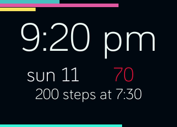

# Day Maker
A watchface and alarm that will help you get up by making sure you take a configurable number of steps before it stops buzzing.

The three bars at the top are steps, calories, and elevation gain (floors).

The watchface features configurable heartrate display and the ability to turn off the alarm (but no snooze!).

The two bars at the bottom are active minutes and a battery indicator.

Uses a slightly modified version of the wonderful [ionic views library](https://github.com/gaperton/ionic-views) to switch between stats screens.